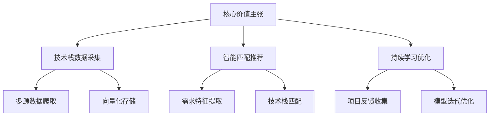
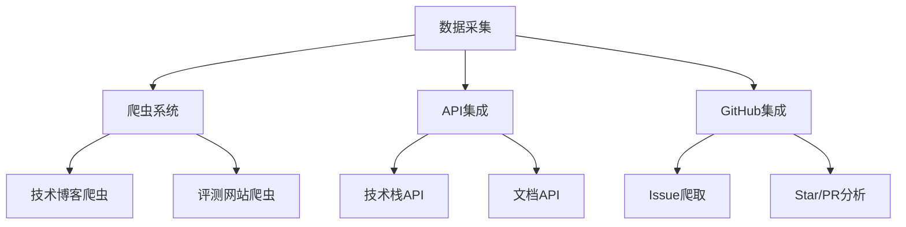
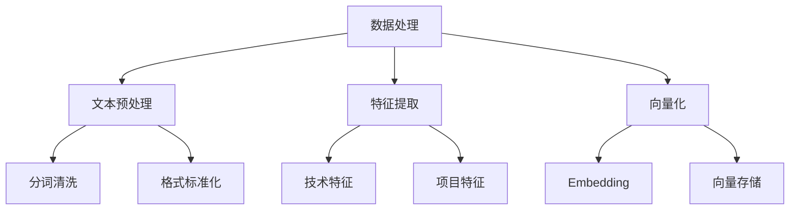
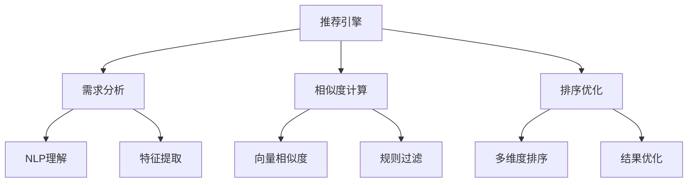
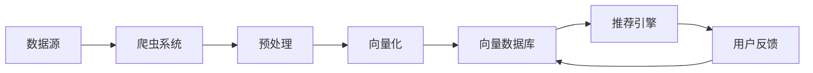
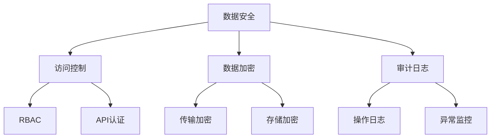
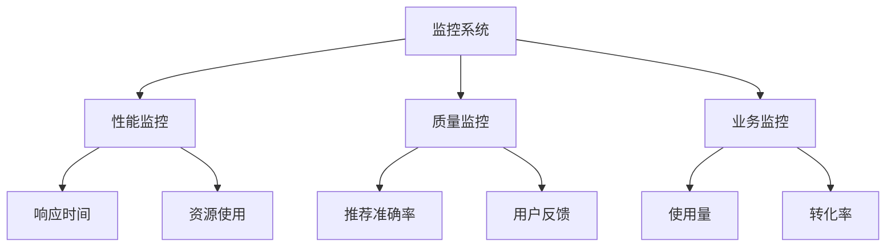
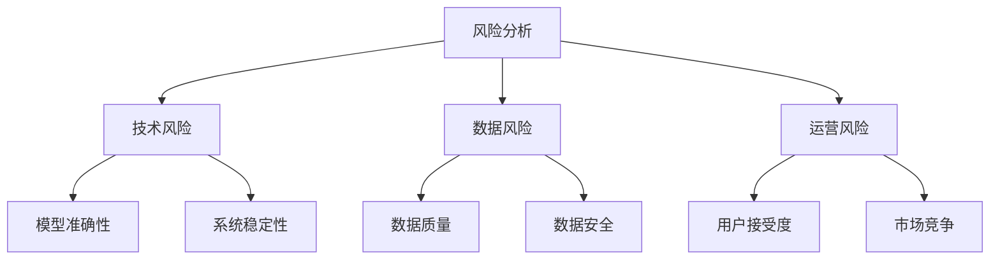

# AI Tech Stack Conoisseur: 智能技术栈推荐系统商业提案

## 一、核心价值主张



## 二、技术架构设计

### 1. 数据采集层



### 2. 数据处理层



### 3. 推荐引擎



## 三、具体技术实现

### 1. 数据采集实现

```python
# 爬虫系统核心代码示例
class TechStackCrawler:
    def __init__(self):
        self.sources = {
            'blogs': ['medium.com', 'dev.to'],
            'docs': ['docs.github.com', 'developer.mozilla.org'],
            'github': ['github.com']
        }
        self.vector_db = VectorDatabase()
    
    async def crawl_source(self, source_type):
        for source in self.sources[source_type]:
            content = await self.fetch_content(source)
            processed = self.preprocess(content)
            vector = self.embed(processed)
            await self.vector_db.store(vector)
```

### 2. 向量数据库设计

```python
# 向量数据库结构
class VectorDatabase:
    def __init__(self):
        self.db = {
            'tech_stacks': {},  # 技术栈向量
            'projects': {},     # 项目需求向量
            'feedback': {}      # 用户反馈向量
        }
    
    async def store(self, vector, metadata):
        # 存储向量和元数据
        pass
    
    async def search(self, query_vector, top_k=5):
        # 相似度搜索
        pass
```

### 3. 推荐系统实现

```python
# 推荐系统核心代码
class TechStackRecommender:
    def __init__(self):
        self.vector_db = VectorDatabase()
        self.nlp_model = NLPModel()
    
    async def recommend(self, project_requirements):
        # 1. 需求特征提取
        features = await self.nlp_model.extract_features(project_requirements)
        
        # 2. 向量化
        query_vector = await self.embed(features)
        
        # 3. 相似度搜索
        candidates = await self.vector_db.search(query_vector)
        
        # 4. 结果优化
        recommendations = await self.optimize_results(candidates)
        
        return recommendations
```

## 四、数据流程



## 五、技术栈选择

### 1. 核心组件
- **爬虫框架**: Scrapy + Playwright
- **向量数据库**: Milvus/Pinecone
- **NLP模型**: BERT/RoBERTa
- **推荐系统**: Faiss + 自定义排序算法
- **API框架**: FastAPI
- **存储系统**: PostgreSQL + Redis

### 2. 部署架构
- **容器化**: Docker + Kubernetes
- **CI/CD**: GitHub Actions
- **监控**: Prometheus + Grafana
- **日志**: ELK Stack

## 六、数据安全与隐私



## 七、扩展性设计

### 1. 水平扩展
- 爬虫节点可动态扩展
- 向量数据库分片
- 推荐引擎负载均衡

### 2. 垂直扩展
- 模型优化与更新
- 特征工程增强
- 算法迭代改进

## 八、监控与运维



## 九、未来规划

1. **模型优化**
   - 引入更多预训练模型
   - 实现增量学习
   - 优化特征工程

2. **功能扩展**
   - 技术栈对比分析
   - 迁移成本评估
   - 性能预测

3. **生态建设**
   - 开发者社区
   - 技术博客
   - API市场

## 十、风险评估


