# NEXTAI DINER: 平价AI游戏化餐厅商业提案
融合动态餐桌/VIP游戏/健康消费闭环的下一代餐饮体验

## 一、核心价值主张

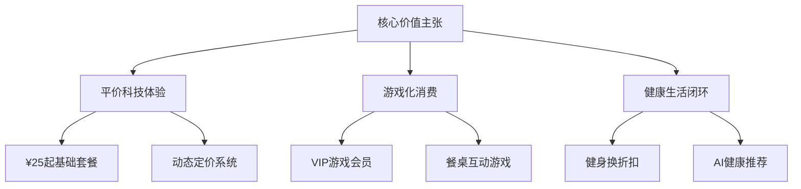

## 二、三大收入引擎

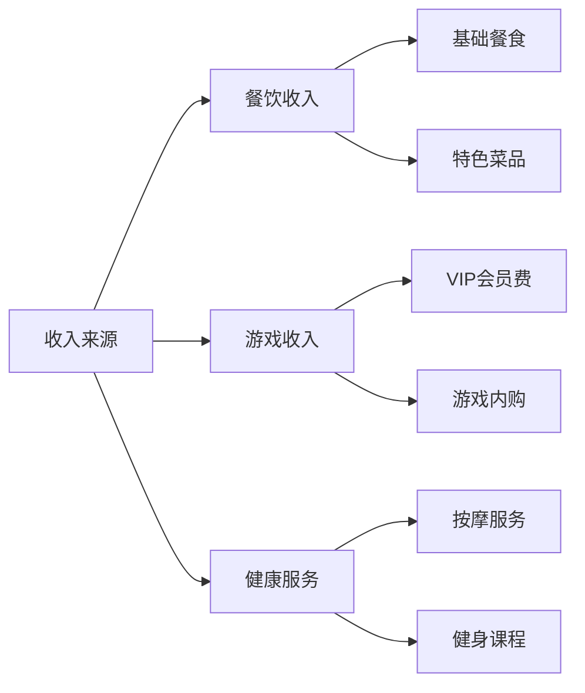

## 三、核心技术架构

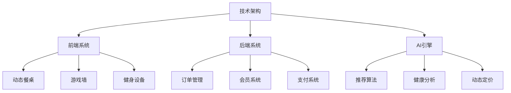

## 四、空间布局与成本模型

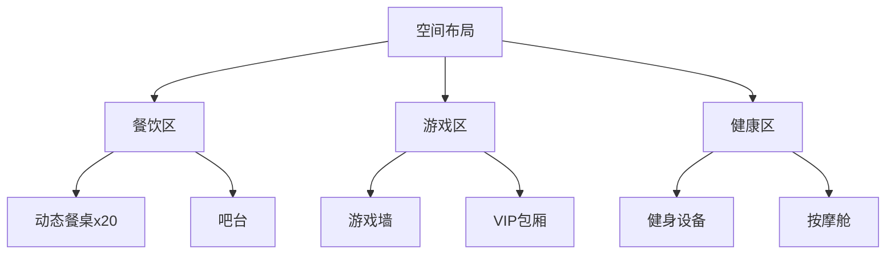

## 五、差异化运营策略

### 1. 游戏化会员体系

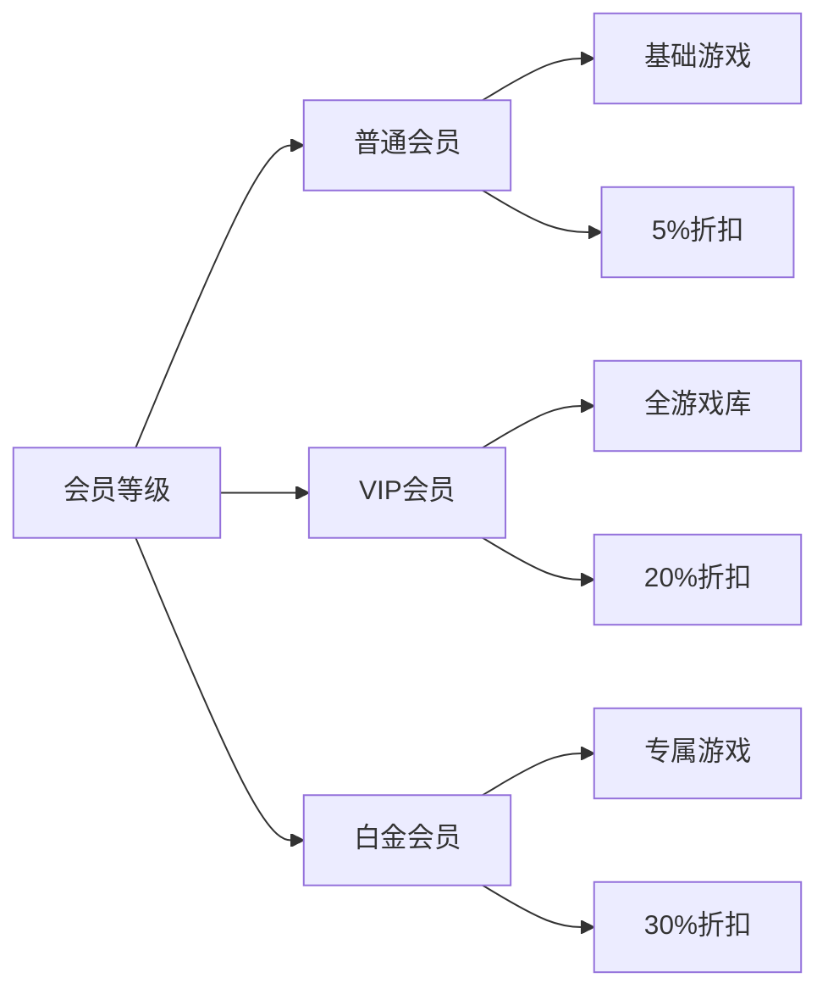

### 2. 动态定价系统
- 基础公式：午市基础套餐 = ¥25 + (健身舱使用率 x ¥2) - (空桌率 x ¥3)
- 时段系数：高峰时段 +15%，低谷时段 -10%
- 会员折扣：VIP -20%，白金 -30%

## 六、执行路线图

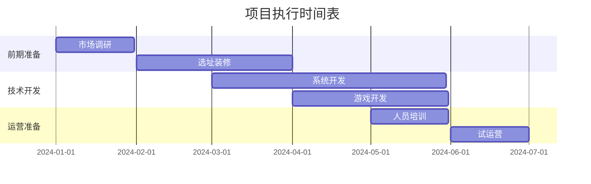

## 七、风险对冲方案

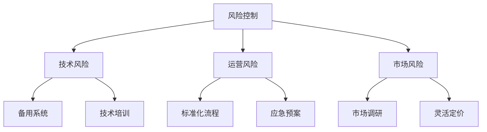

## 八、财务预测

### 首年运营目标
- 日均客流量：300人
- 客单价：¥45
- 会员转化率：30%
- 月均收入：¥40.5万

### 成本结构
- 固定成本：¥15万/月
- 变动成本：¥20万/月
- 预期利润：¥5.5万/月

## 九、核心竞争优势

1. 游戏资产补贴餐饮成本，让科技体验下沉至大众消费层级
2. 时间货币化（健身→折扣）解决客流量低谷期设备闲置问题
3. AI驱动的个性化体验提升用户粘性
4. 多维度收入来源确保经营稳定性

## 十、后续发展计划

1. 连锁扩张：3年内开设5家直营店
2. 技术升级：持续优化AI算法和游戏内容
3. 品牌合作：与游戏IP和健康品牌建立战略合作
4. 社区运营：建立用户社区，增强品牌粘性

## 十一、用户故事

### 用户故事1：健身-用餐-放松的闭环体验

小李是一名白领，下班后来到NEXTAI DINER。他先在健身区选择了跑步机和哑铃进行锻炼，系统自动记录运动数据。健身结束后，AI根据他的运动量和健康档案推荐高蛋白低脂套餐。用餐后，小李前往健康区，躺在recliner沙发椅上，戴上眼罩和耳机，享受binaural冥想音乐，身心彻底放松。

### 用户动线可视化

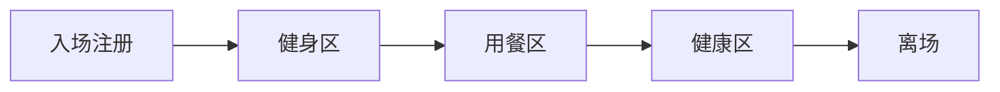

## 十二、MVP（最小可行产品）构建

### 健身区MVP配置
- 跑步机（2台）
- 动感单车（2台）
- 哑铃架（1组，2-20kg）
- 多功能拉力器（1台）
- 瑜伽垫（4块）
> 选择标准：覆盖90%常见锻炼需求，设备少而精，保证每位用户都能练到。

### 用餐区MVP配置
- 动态交互餐桌（8张）
- 高蛋白套餐（如鸡胸肉饭、豆腐沙拉、蛋白奶昔）
- AI点餐推荐系统

### 健康区MVP配置
- Recliner沙发椅（6张）
- 眼罩、降噪耳机
- Binaural冥想音乐播放

### MVP结构图

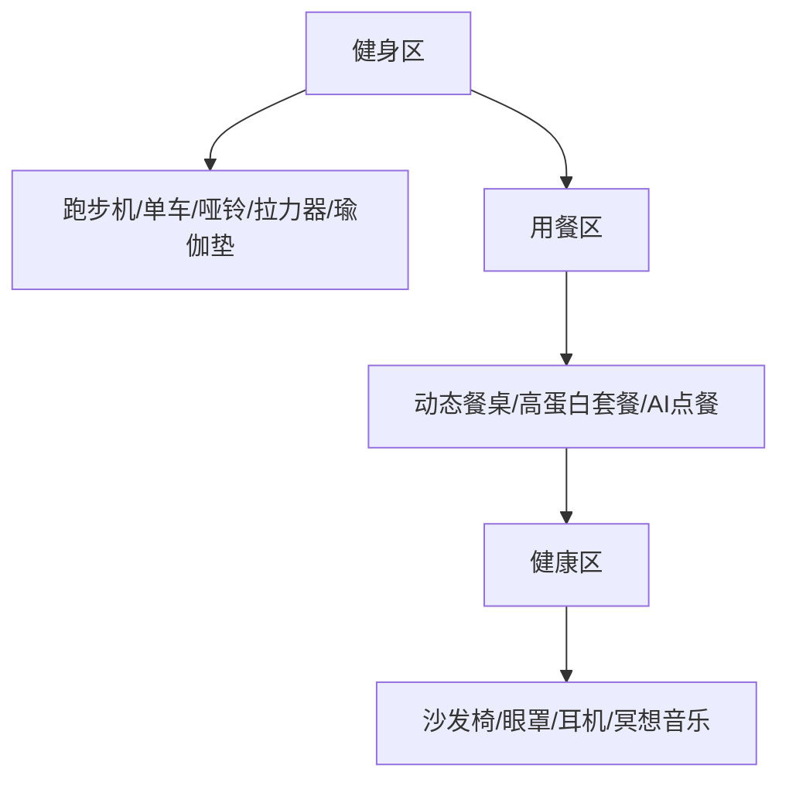

## 十三、场景构建与推导收入公式

### 场景动线描述
1. 用户入场注册，选择健身器材锻炼（数据计入会员系统）
2. 健身后AI推荐个性化高蛋白餐，用户用餐
3. 用餐后前往健康区，享受冥想放松服务
4. 离场，系统结算本次消费并推送健康报告

### 收入公式推导

- 单用户总收入 = 健身区收入 + 餐饮区收入 + 健康区收入
- 健身区收入 = 健身单次费 × 健身人数 × 健身区使用率
- 餐饮区收入 = 客单价 × 用餐人数 × 用餐区使用率
- 健康区收入 = 放松单次费 × 健康区人数 × 健康区使用率

> 例如：
> - 健身单次费 ¥15，健身区日均使用40人
> - 客单价 ¥45，用餐区日均60人
> - 放松单次费 ¥10，健康区日均30人
> - 日收入 = 15×40 + 45×60 + 10×30 = ¥600 + ¥2700 + ¥300 = ¥3600

### 收支对比

- 日收入：¥3600
- 日成本：
  - 健身区成本：¥200（设备维护、水电）
  - 餐饮区成本：¥1800（食材、人工）
  - 健康区成本：¥100（设备维护、音乐版权）
  - 日总成本：¥2100
- 日利润：¥3600 - ¥2100 = ¥1500

### 蛋白粉饮料讨论

- **提供蛋白粉饮料的可能性**：
  - 成本：每杯蛋白粉饮料成本约¥5（含人工）
  - 售价：¥15/杯
  - 预期销量：日均20杯
  - 日收益：20 × (¥15 - ¥5) = ¥200
  - 结论：蛋白粉饮料可作为高毛利补充产品，提升整体利润。

## 十四、供应链建设

### 全自动化供应链流程

- **食材采购**：与本地农场、供应商建立长期合作，确保食材新鲜、安全。
- **中央厨房**：设立中央厨房，统一加工、包装，确保菜品标准化。
- **配送系统**：采用智能配送系统，实时监控配送路线，确保食材及时送达。
- **库存管理**：使用AI系统预测需求，动态调整库存，减少浪费。

### 中央厨房布局

- **加工区**：配备自动化切菜机、烹饪机器人，提高效率。
- **包装区**：使用真空包装技术，延长食材保质期。
- **质检区**：设立食品安全检测站，确保每批次食材符合标准。

### 与健康平台合作

- **薄荷健康合作**：接入薄荷健康API，获取用户健康数据，优化菜品推荐。
- **数据共享**：与平台共享用户饮食偏好、健康指标，提升个性化服务。
- **联合营销**：共同推出健康饮食活动，吸引目标用户。

### 供应链流程图

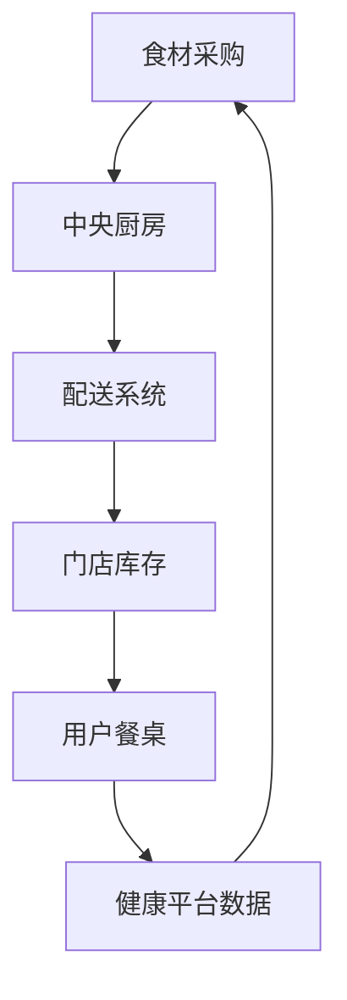

## 十五、卫生问题解决方案

### 健身出汗后卫生问题

- **工作人员带路**：用户健身后，由工作人员引导至健康区，确保动线清晰。
- **吸汗垫隔离**：在recliner沙发椅上铺一层吸汗垫（类似SPA床垫纸），隔离汗液，确保卫生。
- **定期消毒**：每2小时对健康区进行全面消毒，确保环境清洁。

### 动态定价策略

- **时间越晚价格越便宜**：借鉴钱大妈营销策略，健康区服务价格随时间递减。
  - 18:00-20:00：原价
  - 20:00-22:00：8折
  - 22:00后：5折
- **目的**：吸引用户错峰消费，提高设备利用率。

## 十六、范例菜谱

### 常见单人餐

- **高蛋白套餐**：
  - 鸡胸肉饭（¥35）：鸡胸肉、糙米、西兰花
  - 三文鱼沙拉（¥40）：三文鱼、牛油果、混合蔬菜
  - 蛋白奶昔（¥25）：蛋白粉、香蕉、燕麦

- **低脂套餐**：
  - 豆腐沙拉（¥30）：豆腐、黄瓜、胡萝卜、芝麻酱
  - 藜麦碗（¥35）：藜麦、烤蔬菜、鹰嘴豆

- **素食套餐**：
  - 素食意面（¥30）：全麦意面、番茄酱、蘑菇
  - 素食卷（¥25）：全麦卷、豆芽、胡萝卜、黄瓜

## 十七、选址策略

### 投放区域分析

- **高端富人区**：
  - 目标用户：高收入、注重健康的白领
  - 优势：客单价高，用户粘性强
  - 劣势：租金成本高

- **机场**：
  - 目标用户：商务旅客、高端游客
  - 优势：客流量大，品牌曝光高
  - 劣势：运营时间受限，租金高

- **商用楼**：
  - 目标用户：上班族、健身爱好者
  - 优势：固定客源，租金适中
  - 劣势：竞争激烈，需差异化服务

### 选址标准

- **客流量**：日均客流量≥1000人
- **租金成本**：月租金≤¥10万
- **交通便利**：地铁站/公交站步行≤10分钟
- **目标用户匹配**：周边3公里内目标用户占比≥30%

## 十八、动态AI餐桌功能

### 用户注册与预定

- **用户注册**：用户注册后录入个人信息（如饮食偏好、健康数据、社交标签）。
- **预定餐桌**：用户可提前预定餐桌，或选择随机匹配食客功能。

### 随机匹配食客

- **AI匹配**：系统从门店正在匹配的食客中，根据AI匹配分数（如兴趣、饮食偏好、社交标签）挑选若干位凑桌。
- **匹配流程**：用户选择"随机匹配"后，系统实时推送匹配结果，用户确认后即可入座。

### AI推荐菜品

- **个性化推荐**：AI根据用户注册信息（如健康数据、饮食偏好、历史订单）自动推荐菜品。
- **推荐逻辑**：系统分析用户数据，结合当前时段、天气等因素，生成个性化推荐列表。

### 后厨直播与品牌介绍

- **后厨直播**：AI餐桌实时展示后厨厨师烹饪过程，增强透明度和互动感。
- **品牌介绍**：餐桌可播放品牌故事、食材来源、健康理念等内容，用户也可自由定制播放内容。

### 多人游戏

- **专属屏幕**：餐桌上每位食客拥有专属屏幕，可独立操作。
- **游戏内容**：提供多人互动游戏（如"美食大作战"、"健康知识问答"），增强社交体验。

### AI餐桌功能流程图

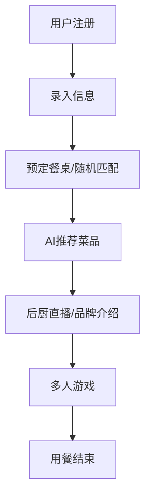

